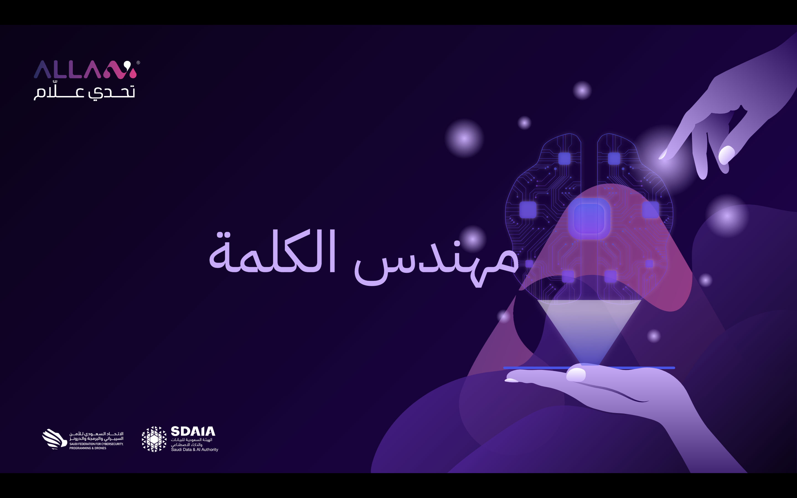

# مهندس الكلمة - The Word Engineer

## ALLaM Challenge - SDAIA

August - November 2024

This is our submission for ALLaM Challenge 2024, hosted by the Saudi Data & AI Authority (SDAIA).

### [Presentation Slides](presentation.pdf)

## Authors

- **Abdullah Alwakeel**
- **Abdulrahman Alshahrani**

## Project Description

Our project aims to improve the quality of AI Arabic poetry generation by using **chain-of-thought** and **trial-and-error** techniques.

### Chain of Thought

With **chain-of-thought**, the model is able to set a plan for its poem before generating it, and also iteratively critique its own generation. This technique reduces the amount of linguistic errors and increases the response's relevancy to the user prompt.

### Trial and Error

Powered with poetry analysis tools, the model is also able to backtrack on incorrect generations and retry to ensure the generated poems are correct linguistically and follow Arabic poetry rules.

## Usage

### - Backend (Python Flask)

#### Install dependencies

`pip install -r requirements.txt`

#### Running the backend API server

`python website.py`

#### Alternatively, you can run a CLI (Command-Line Interface) version

`python main.py`

### - Frontend (Vite + React + TS)

#### Install dependencies

`cd allam-website && npm i`

#### Running the frontend

`npm run build`
